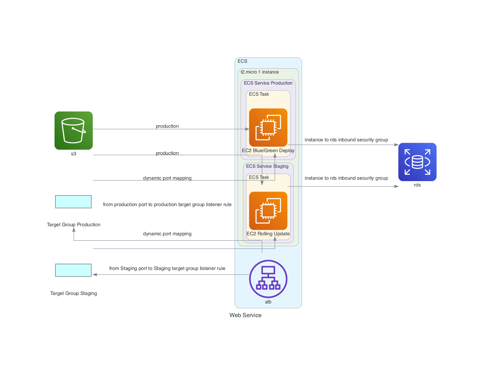

<p align="center">
  <a href="http://nestjs.com/" target="blank"></a>
</p>

# Getting Started

```bash
docker-compose up
```

# Generate infrastructure diagram

```bash
yarn diagram
```

# Infrastructure design



# generate migration file

docker-compose.yml
- yarn start:dev -> yarn start:prod
- environmentをdevelop -> production

その後に、yarn typeorm migration generate -n MIGRATION_FILE_TITLE

why
develop環境では、nestjsに{autoLoadEntities: true}を設定しているため、entityファイルの内容がdatabaseに自動で反映される。

# 複合主キー(複合主カラム) - composite primary columns

https://typeorm.io/#:~:text=You%20can%20have%20composite%20primary%20columns%20as%20well%3A

## Test

```bash
# unit tests
yarn test

# e2e tests
yarn test:e2e

# test coverage
yarn test:cov
```
